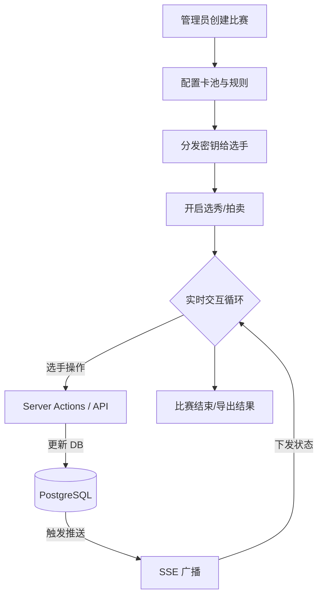

# 宝可梦选秀系统架构指南 (Architecture Guru Guide)

> [!TIP]
> 如果你是第一次接触本项目，本指南将帮助你建立起整个系统的“思维模型”，而不只是罗列文件。

## 1. 核心思维模型：系统是如何运行的？

你可以把本系统看作一个 **“由实时状态驱动的竞价引擎”**。整个系统围绕着 `Contest`（比赛）状态的演进展开。

### 1.1 业务全景图

## 2. 三大核心支柱 (The 3 Pillars)

作为一个新手，你只需要理解这三个核心技术点，就能看懂 80% 的代码：

### 2.1 实时推送 (SSE Stream) —— “系统的脉搏”

- **为什么不用 WebSocket?** 因为选秀是单向广播为主（一人操作，众人观看），SSE 更轻量且原生支持 HTTP。
- **关键路径**: `app/api/contests/[id]/stream/route.ts`
- **思维点**: 服务器像一个不断的收音机电台，一旦数据库变了，它就向所有连接的听众（浏览器）喊话。

### 2.2 可行性算法 (DP Algorithm) —— “系统的逻辑卫兵”

- **它是干嘛的?** 防止玩家把钱花光导致最后几轮买不起怪。
- **关键路径**: `app/lib/business/draft.ts`
- **思维点**: 这是一个后台隐形教练。每当你要出价或选人，它都会在 0.1ms 内模拟成千上万种未来的可能性，确保你至少有一种方式能选满 6 只怪。

### 2.3 智能合并 (Smart Merge) —— “性能的黑科技”

- **挑战**: 宝可梦数据（名字、属性、图片 URL）很大，每次推送几百 KB 会卡顿。
- **方案**: 浏览器只在第一次连接时拉取“厚数据”（全量）。之后的 SSE 只推送“薄数据”（ID 和 状态）。前端通过 `useContestStream` 自动把薄数据缝补进厚数据里。

## 3. 数据流向图 (Data Journey)

从“Showdown 原始数据”到“玩家屏幕上的图标”，数据经历了以下旅程：

1. **导入期**: `scripts/core/data/` 里的脚本将 Showdown 的 TS 文件清洗并灌入数据库。
2. **准备期**: 管理员通过 `/admin/create` 筛选出特定的宝可梦存入 `PokemonPool` 关联表。
3. **活动期**:
   - 玩家在前端发起 Action。
   - 服务端验证权限 -> 修改 DB。
   - SSE 检测到版本号变更 -> 广播 `partial` 数据包。
   - 前端 `useContestStream.ts` 接收 -> 更新全局 Context -> UI 重新渲染。

## 4. 导游地图：我该去哪看代码？

### 🏗️ 我想看 UI 界面

- **管理员后台**: `app/admin/`
- **选手房间**: `app/player/`
- **通用卡片/面板**: `app/components/`

### 🧠 我想看业务逻辑

- **选秀/DP 核心**: `app/lib/business/`
- **实时同步钩子**: `app/lib/hooks/useContestStream.ts`

### 🌐 我想看接口定义

- **管理员 API**: `app/api/admin/`
- **实时推送接口**: `app/api/contests/[id]/stream/`

### 🛠️ 我想看运维脚本

- **数据处理**: `scripts/core/data/`
- **一键部署**: `scripts/prod/`

## 5. 开发者快速上手建议

1. **从数据库开始**: 读一遍 `prisma/schema.prisma`。理解 `Contest`, `Player`, `PokemonPool` 之间的三角关系，这是理解整个系统的钥匙。
2. **观察 SSE 报文**: 在浏览器 F12 -> Network -> 找到 `stream` 接口。观察里面推送的 JSON 结构，你会发现它是如何驱动 UI 变化的。
3. **理解 Action 模式**: 本系统几乎所有的状态变更都是通过 API 调用完成的，然后由 SSE 同步回 UI。这是一种 **“单向数据流”** 的思想。

---

> [!NOTE]
> 记录于 2026-02-07。如果你发现文档与代码不符，请记得你是“逻辑卫兵”的一员，请及时更新它。
