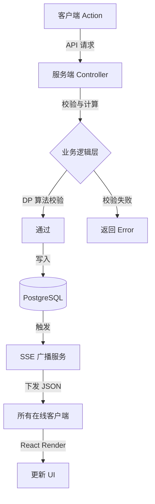

# 宝可梦选秀系统架构文档

本文档旨在帮助开发团队快速理解本项目的技术实现。我们去掉了所有的修饰词，只讲核心逻辑和数据流向。

## 1. 系统核心逻辑

本系统本质上是一个 **"基于状态同步的竞价应用"**。

核心循环如下：

1.  **触发**: 管理员或选手发起操作 (Server Action / API)。
2.  **变更**: 服务端校验逻辑，更新 PostgreSQL 数据库。
3.  **推送**: 数据库变更触发 SSE (Server-Sent Events) 广播。
4.  **渲染**: 客户端接收新状态，更新 React Context，界面重绘。

### 业务流程图

```mermaid
graph TD
    A[客户端 Action] -->|API 请求| B[服务端 Controller]
    B -->|校验与计算| C{业务逻辑层}
    C -->|DP 算法校验| D[通过]
    C -->|校验失败| E[返回 Error]
    D -->|写入| F[(PostgreSQL)]
    F -->|触发| G[SSE 广播服务]
    G -->|下发 JSON| H[所有在线客户端]
    H -->|React Render| I[更新 UI]
```

## 2. 关键技术点

### 2.1 实时通信：SSE (Server-Sent Events)

我们没有使用 WebSocket，而是选择了 SSE。

- **原因**: 选秀场景是"少写多读"（一个操作，全员更新）。SSE 基于 HTTP，更轻量，且原生支持自动重连，非常适合这种广播场景。
- **代码位置**: `app/api/contests/[id]/stream/route.ts`
- **机制**: 客户端建立一个长连接，服务端每隔 2 秒或在事件触发时写入数据流。

### 2.2 数据一致性：动态规划 (DP) 校验

这是本项目最复杂的后端逻辑。

- **问题**: 在蛇形选秀中，如果选手花钱太快，可能导致最后几轮即便买最便宜的怪也买不起，造成死锁。
- **方案**: 每次出价或选人前，后台运行一个背包算法（Knapsack-like），模拟该选手剩余轮次的所有可能性。如果找不到一种合法组合，则拒绝当前操作。
- **代码位置**: `app/lib/business/draft.ts`

### 2.3 前端性能：静态/动态数据分离

宝可梦数据包含大量文本（中文名、介绍）和图片 URL，如果每次 SSE 都全量推送，带宽压力会很大。

- **策略**:
  - **厚数据 (Static)**: 首次加载页面时，拉取全量宝可梦基础数据（名字、种族值、属性）。
  - **薄数据 (Dynamic)**: SSE 只推送变化的数据（ID、被谁选中了、当前价格）。
- **实现**: 前端 `useContestStream` Hook 负责将 SSE 收到的 ID 与本地缓存的厚数据进行合并（Merge）。

## 3. 数据流向 (Data Pipeline)

### 第一阶段：数据入库 (ETL)

我们不手动录入数据。所有数据来自 `scripts/core/data/` 下的脚本。

1.  **Fetch**: 从 Pokemon Showdown GitHub 仓库拉取最新的 `.ts` 文件。
2.  **Extract**: 解析文本，提取种族值、属性等。
3.  **Import**: 写入本地 Postgres 数据库。

### 第二阶段：比赛初始化

管理员在 `/admin/create` 创建比赛时：

1.  从全量库中筛选出特定子集（如 "Gen9 + 晴天队"）。
2.  将这些数据复制到 `PokemonPool` 表中，与该场 `Contest` 绑定。
3.  **注意**: 比赛开始后，该比赛的数据就与全量库解耦了，修改全量库不会影响进行中的比赛。

## 4. 目录结构说明

为了方便大家查找代码，这里列出核心目录的对应关系：

| 目录                | 说明             | 关键文件                                     |
| :------------------ | :--------------- | :------------------------------------------- |
| `app/admin/`        | 管理员后台页面   | `spectate/page.tsx` (控制台)                 |
| `app/player/`       | 选手端页面       | `room/page.tsx` (选秀室)                     |
| `app/lib/business/` | **核心业务逻辑** | `draft.ts` (DP算法), `auction.ts` (竞价逻辑) |
| `app/lib/hooks/`    | 前端逻辑复用     | `useContestStream.ts` (SSE 处理)             |
| `app/api/`          | 后端接口         | `admin/`, `player/`, `stream/`               |
| `scripts/`          | 运维与测试脚本   | `dev.sh`, `prod.sh`, `test/`                 |

## 5. 开发建议

如果你刚加入项目，建议按以下顺序上手：

1.  **看数据库设计**: 打开 `prisma/schema.prisma`。理解 `Contest` (比赛)、`Player` (选手)、`PokemonPool` (卡池) 这三张表的关系，是理解业务的基础。
2.  **看接口**: 关注 `app/api/player/bid` (出价) 和 `app/api/player/nominate` (提名)，这是竞价模式的两个核心动作。
3.  **调试**: 遇到数据不同步问题时，第一时间看浏览器 Network 面板的 `stream` 请求。看服务端推下来的 JSON 是不是新的。如果 JSON 是新的但界面没变，那是前端 React 的问题；如果 JSON 没变，那是后端数据库没更新。

---

_文档即代码，发现逻辑变更请及时更新本文档。_
